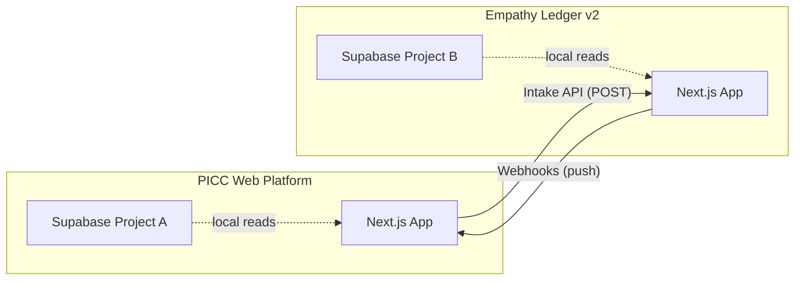
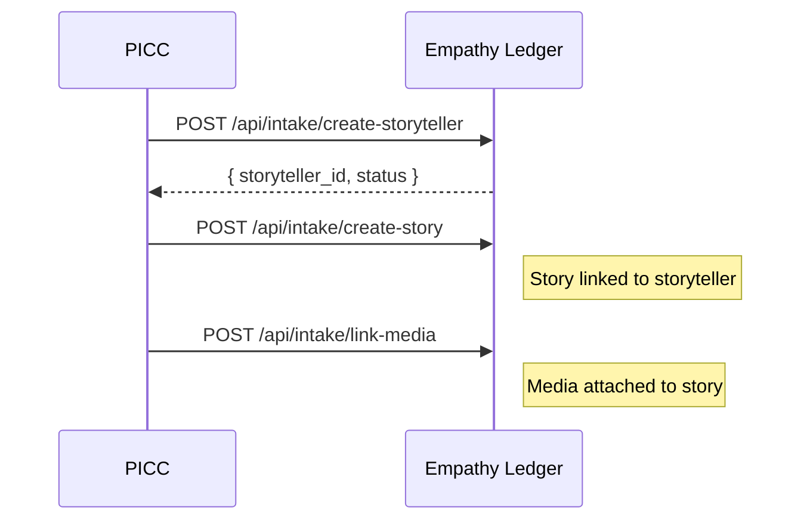
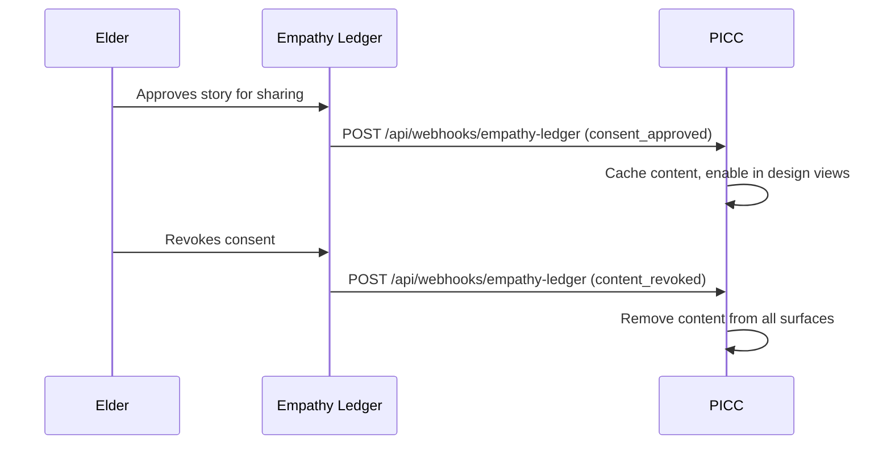
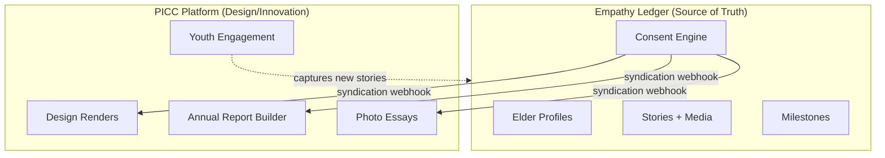

# PICC <-> Empathy Ledger v2 Sync Architecture

> Working document. Last updated: 2026-04-02

## Overview

Two-way sync between the PICC Web Platform and Empathy Ledger v2 (EL). The organisation in EL is **"Palm Island CC"**. PICC becomes a design/testing/innovation platform. EL becomes the source of truth for all people, stories, services, financials, and annual report data.

Both platforms run Next.js + Supabase but connect to **different Supabase projects** (separate databases, separate auth).



---

## Data Flow

### PICC -> EL (Migration + Ongoing Capture)

PICC pushes data into EL via the Intake API. This is the initial migration path and the ongoing capture path for new content created on PICC.

| PICC Source | EL Destination | Intake Endpoint |
|---|---|---|
| Elder profiles | `storytellers` | `POST /api/intake/create-storyteller` |
| Stories | `stories` | `POST /api/intake/create-story` |
| Media files | `media_assets` | `POST /api/intake/link-media` |
| Services | `activities` + `outcomes` | TBD |
| Financial data | `funding_received` + SROI tables | TBD |
| Annual report structure | `content_syndication` | TBD |



### EL -> PICC (Syndicated Content)

EL pushes elder-approved, culturally-safe content back to PICC via webhooks. PICC registers as a `syndication_site` in EL's syndication system.

**Webhook events:**

| Event | Trigger | PICC Action |
|---|---|---|
| `content_updated` | Story/profile edited and re-approved | Update local cache |
| `consent_approved` | Elder approves content for external use | Enable content in design renders |
| `content_revoked` | Elder revokes consent | Remove from all PICC surfaces immediately |



---

## Authentication

| Direction | Header | Env Var |
|---|---|---|
| PICC -> EL (Intake) | `X-Intake-Key` | `EMPATHY_LEDGER_INTAKE_KEY` |
| EL -> PICC (Syndication) | `X-API-Key` | `EMPATHY_LEDGER_API_KEY` |
| Base URL | -- | `EMPATHY_LEDGER_API_URL` |

Both keys are static secrets shared between the two platforms. No user-level auth crosses the boundary -- each platform handles its own user sessions independently.

---

## Key Principles

1. **EL is source of truth** for people and stories. OCAP/PCAP sovereignty enforced there.
2. **PICC is design/innovation** -- reads from EL, never writes people data directly to its own DB.
3. **Cultural protocols at EL level** -- elder approval, consent tiers, sensitivity flags all live in EL. PICC trusts the syndication output.
4. **Storytellers control their data** -- PCAP alignment happens in EL. Revocation is instant and non-negotiable.
5. **Sync is idempotent** -- migration script maintains an ID mapping file. Re-running is safe.
6. **ALMA v2.0 analysis in EL** -- narrative analysis runs in EL, results flow to PICC for display only.

---

## Technical Implementation

### Files in this repo (PICC side)

| File | Purpose | Status |
|---|---|---|
| `lib/empathy-ledger/el-api-client.ts` | API client for EL intake endpoints | To build |
| `scripts/migrate-elders-to-el.ts` | One-time + incremental migration script | To build |
| `scripts/.elder-migration-map.json` | ID mapping (PICC elder ID -> EL storyteller ID) | Generated |
| `app/api/webhooks/empathy-ledger/route.ts` | Webhook receiver for syndication events | To build |

### ID Mapping

The migration script creates and maintains a mapping file:

```json
{
  "migrated_at": "2026-04-02T00:00:00Z",
  "mappings": {
    "picc_elder_uuid_1": "el_storyteller_uuid_1",
    "picc_elder_uuid_2": "el_storyteller_uuid_2"
  }
}
```

This file is gitignored (contains UUIDs that could identify individuals). The migration script checks it before creating duplicates.

---

## Elders Project (First Implementation)

The Elders project is the first to use this sync architecture.

- Elders get full EL accounts with sovereignty over their content
- Journey and milestone tracking via EL's `storyteller_milestones` table
- Youth engagement layer stays on PICC (design/innovation side)
- External sharing packages generated from EL's syndication system
- PICC renders design views using syndicated content only



---

## Future Projects (Same Pattern)

After Elders, the same PICC <-> EL sync pattern applies to:

- **20th Year Celebration** -- historical content curated in EL, design/presentation on PICC
- **Service Innovation Tracking** -- service outcomes in EL, innovation dashboard on PICC
- **Community Voice Amplification** -- voices captured in EL, amplified via PICC design tools
- **Cultural Travel Program** -- documentation in EL, public-facing content via PICC syndication

Each project registers as a syndication context in EL. PICC subscribes to relevant webhook events per project.

---

## Open Questions

- [ ] Webhook retry/failure handling strategy (dead letter queue? simple retry?)
- [ ] Whether PICC should cache syndicated content in its own Supabase or fetch on demand
- [ ] Bulk sync endpoint for initial population vs individual record intake
- [ ] How ALMA analysis results are structured for PICC consumption
- [ ] Service and financial data intake endpoint design
